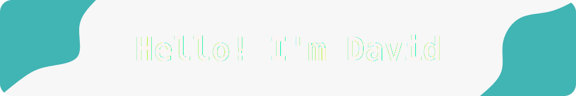
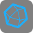
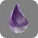

I am an engaged Cybersecurity Student🎓 studying in Germany. 
I can speak English, German, Hungarian and a little French. 
During my studies, I did a one-year technical student internship at [CERN](https://home.cern).
There I was mostly working on CERN's Open Data service [@cernopendata](https://github.com/cernopendata).

I am passionate about security focused software development💻, service monitoring🔭 and open source software📂. 
Furthermore, I enjoy learning about new topics💡, and gazing at the stars of the night sky🌌.

 

A selection of languages, frameworks and software that I have experience with:

  
  
  
  
  
  
  
  
  

    

  
  
  
  
  
  
  
  
  
  
  

 

In addition, I am currently learning about the following:

  
  
  
  

 

  
  

    <h3>My favourite project I work on ❤️</h3>
    
  

 

**Checkout one of my repositories pinned below! Leave a star⭐ if you like them❤️!**
