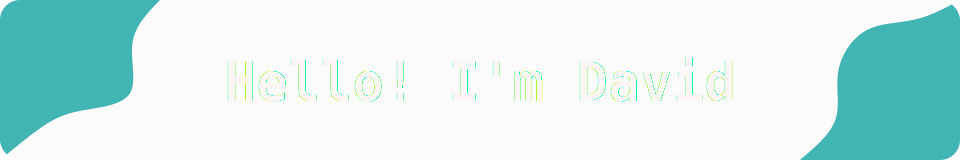

I am an engaged Cybersecurity Student🎓 studying in Germany.
I can speak English, German, Hungarian and a little French.

During my studies, I did a one-year technical student internship at [CERN](https://home.cern).
There I was mostly working on CERN's Open Data service [@cernopendata](https://github.com/cernopendata).
Furthermore, I contributed to the Invenio framework [@invenio](https://github.com/inveniosoftware)
(check our [team](https://inveniosoftware.org/people/) and current developers!)

I am passionate about security focused software development💻, service monitoring🔭 and open source software📂.
Furthermore, I enjoy learning about new topics💡, and gazing at the stars of the night sky🌌.

 

A selection of languages, frameworks and software that I have experience with:

  
  
  
  
  
  
  
  
  
  

  
  
  
  
  
  
  
  
  
  
  

 

In addition, I am currently learning about the following:

  
  
  
  

 

  
  

    <h3>My favourite project I work on ❤️</h3>
    
  

 

I am a huge fan of the following, check them out!

     
    

 

**Checkout one of my repositories pinned below! Leave a ⭐ if you like them!**
**◦ Everyone Welcome 🌈❤️**
